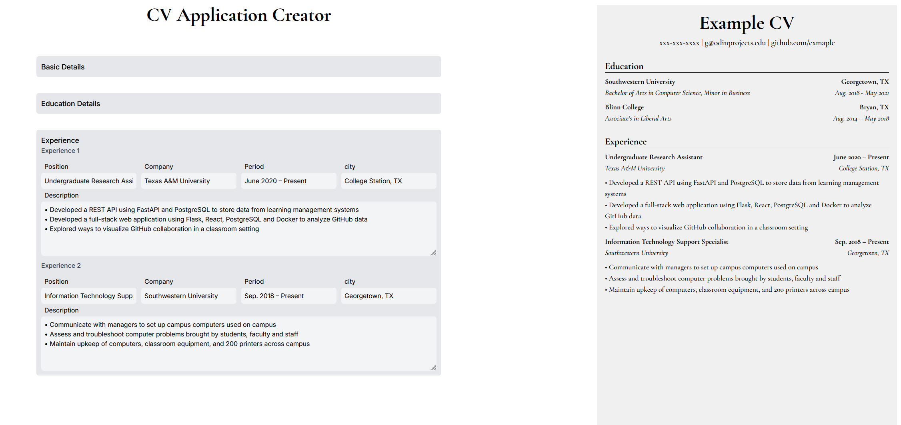

<h3 align="center">CV Application</h3>

  

    Simple and minimal CV Application.  
     
    <a href="https://cv-application-eta-eight.vercel.app/" target="_blank">Live Demo</a>
  

 

<!-- ABOUT THE PROJECT -->

### Preview

 

### Built With

<!-- ACKNOWLEDGMENTS -->

## Acknowledgments

- Inspiration by <a href="https://www.theodinproject.com/lessons/node-path-react-new-cv-application" target="_blank">The Odin Project</a>

- <a href="https://github.com/jakegut/resume" target="_blank">CV template</a>
